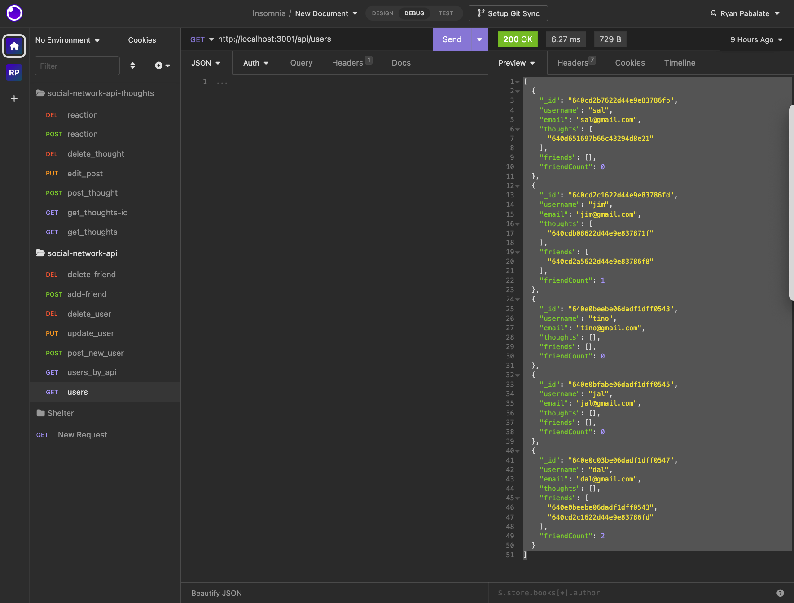
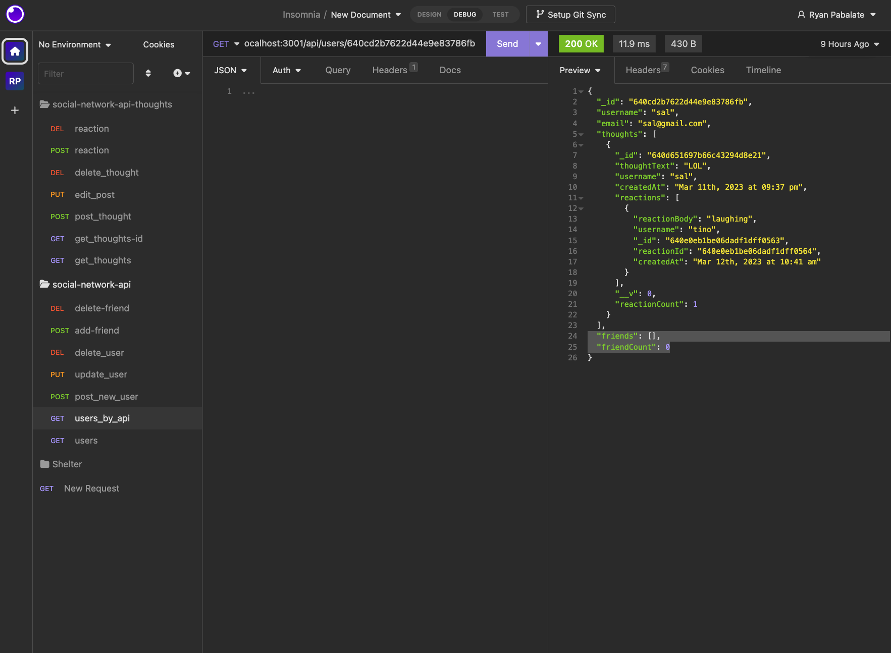
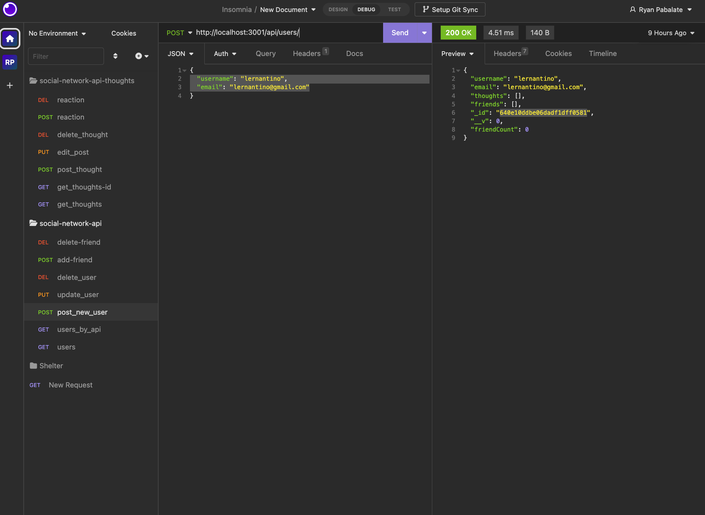
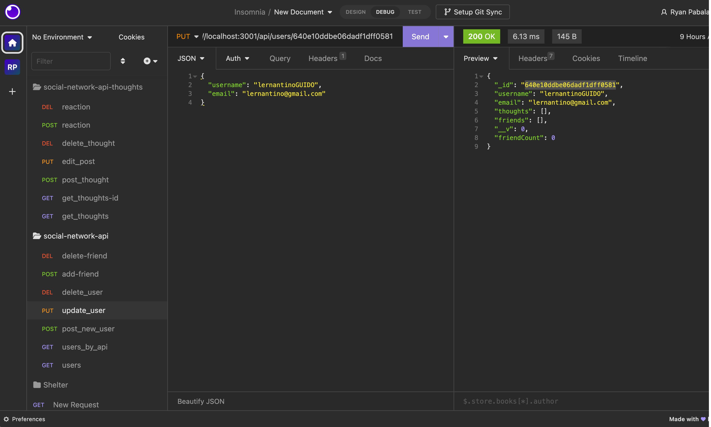
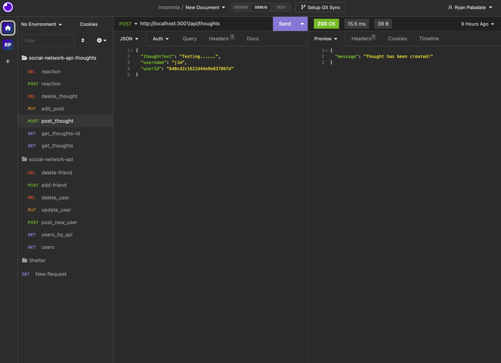
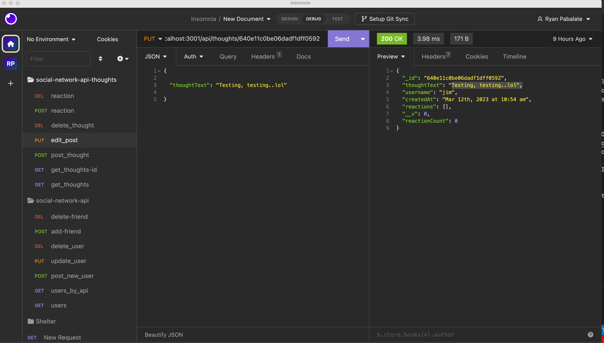
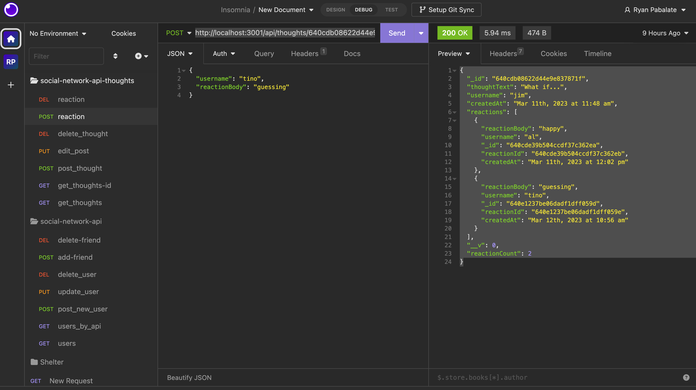

# social-network-api

## Description
Social network api is a backend networking database using MongoDB and Mongoose.  I is an API for a social network web application where users can share their thoughts, react to friends’ thoughts, and create a friend list.


## Table of Contents
* [Links](#links)

* [Installation](#installation)

* [Usage](#usage)

* [License](#license)

* [Code](#code)

* [Tests](#tests)

* [Questions](#questions)

## Links

GitHub URL:  https://github.com/rypab4/social-network-api
Walkthrough: https://drive.google.com/file/d/1Psmw3d4KTwKea-ypFa2TAisOulF96qsR/view
## Installations 

To install necessary dependencies, run the following command if running from github and on local:

```
npm install
    "express": "^4.17.1",
    "mongoose": "^6.0.13"
    "nodemon": "^2.0.9"

mysql

```


## Usage

1.  Install dependencies and run locally on Insomnia.

2.  In CLI enter nodemon server

2.  Get User by setting to GET and type http://localhost:3001/api/users



3.  Get User by setting to GET and type http://localhost:3001/api/users/userID



4.  Create new user by setting to POST and type http://localhost:3001/api/users/userID and set structure to JSON and enter like the following:


5.  To Edit username by setting to PUT and type http://localhost:3001/api/users/userID and set structure to JSON and enter like the following:


6.  Delete username by setting to DELETE and type http://localhost:3001/api/users/userID/

7.  Add a friend by setting to POST and type http://localhost:3001/api/users/userID/friends/(friend)userID

8.  De-friend by setting to DELETE and type http://localhost:3001/api/users/userID/friends/(friend)userID.

9.  Get thoughts by setting to GET and type http://localhost:3001/api/thoughts

10. Get thoughts by setting to GET and type http://localhost:3001/api/thoughts/thoughtsID

11. Create a thought by setting to POST and type http://localhost:3001/api/thoughts and set structure to JSON and enter like the following:


12. Edit a thought by setting to PUT and type http://localhost:3001/api/thoughts/thoughtsID set structure to JSON and enter like the following:


13. Delete a thought by setting to DELETE and type http://localhost:3001/api/thoughts/thoughtsID

14. Add a reaction by setting to POST and type http://localhost:3001/api/thoughts/thoughtsID/reactions/ and set structure to JSON and enter like the following:


15.  Delete a reaction by setting to DELETE and type http://localhost:3001/api/thoughts/thoughtsID/reactions/reactionID


## License
    
none


## Questions
If you have any questions about the repo, open an issue or contact me directly at rypab4@gmail.com.  You can find my work at https://www.github.com/rypab4.